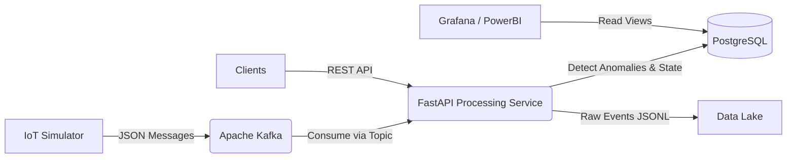

# Port IoT Data Service

A complete microservice architecture for simulating, collecting, processing, and centralizing IoT sensor data from port operations in real time. This platform is designed similarly to enterprise smart port solutions like Marsa Maroc.

## Architecture



## Features

1. **IoT Simulator**: Generates realistic fake data from multiple sensor types (GPS, Temperature, Movement, Equipment Status) across various port zones. Simulates anomalies periodically.
2. **Apache Kafka**: Used as a high-throughput message broker to ingest real-time IoT events.
3. **Processing Service (FastAPI)**:
   - Contains a background asynchronous Kafka consumer.
   - Validates incoming data using Pydantic.
   - Performs real-time anomaly detection (high temperature, invalid GPS, equipment errors).
   - Writes state (sensors, containers, anomalies) into a PostgreSQL database.
   - Appends raw data directly into a local Data Lake (Bronze tier).
   - Serves REST API endpoints to query the processed data.
4. **PostgreSQL Database**:
   - Contains normalized tables for `sensors`, `containers`, and `anomalies`.
   - Uses PostgreSQL Partitioning (`sensor_events`) for high-volume time-series storage.
   - Pre-configured Grafana views.
5. **Data Lake**: Stores raw immutable JSON payloads in a file-system structure (`bronze/`).

## Project Structure

```text
port-iot-service/
├── .env                          # Environment variables
├── docker-compose.yml            # Docker orchestration
├── README.md                     # This file
├── database/                     
│   └── init.sql                  # PostgreSQL schema, partitions, enums, triggers & seed data
├── simulator/                    
│   ├── Dockerfile                # Dockerfile for simulator
│   ├── requirements.txt
│   └── main.py                   # Python script simulating IoT data
└── services/
    └── processing/               # FastAPI backend & Kafka Consumer
        ├── Dockerfile
        ├── requirements.txt
        ├── main.py               # FastAPI entry point
        ├── kafka_consumer.py     # Background Kafka ingestion & processing logic
        ├── database.py           # SQLAlchemy setup
        ├── models.py             # DB Models
        └── schemas.py            # Pydantic schemas
```

## Technologies Used

- **Python 3.11**
- **FastAPI** (REST API)
- **Confluent Kafka** (Event Streaming)
- **SQLAlchemy & Asyncpg** (Database ORM & Async Driver)
- **PostgreSQL 15** (Relational & Time-Series Data)
- **Docker & Docker Compose** (Containerization)

## Setup Instructions

### 1. Prerequisites
Ensure you have Docker and Docker Compose installed on your system.

### 2. Start the Platform
Navigate to the root directory containing `docker-compose.yml` and run:

```bash
cd port-iot-service
docker compose up -d
```

This will start the following containers:
- `zookeeper` (Port 2181)
- `kafka` (Port 9092)
- `kafdrop` (Port 9000) - Kafka Web UI
- `postgres` (Port 5432)
- `fastapi` (Port 8004) - Processing API
- `simulator` - Background Python script emitting events
- `grafana` (Port 3000) - Dashboard tool

### 3. Verify the Deployment

1. **Kafka UI**: Open [http://localhost:9000](http://localhost:9000) to view the `port-iot-data` topic and see messages streaming in real-time.
2. **FastAPI Swagger**: Open [http://localhost:8004/docs](http://localhost:8004/docs) to explore and interact with the REST API.
3. **Data Lake**: Check the auto-generated `data-lake/bronze/` folder in the project root to see raw JSONL files.
4. **Grafana**: Open [http://localhost:3000](http://localhost:3000) (admin / grafana2024). Connect to PostgreSQL using the connection string defined in the `.env` file to visualize the `v_live_sensor_stats`, `v_container_positions`, and `v_anomaly_summary` views.

## API Endpoints

- `GET /health` - Service health check
- `GET /containers` - Get container statuses and locations
- `GET /sensors` - Get active sensors in the port
- `GET /anomalies` - Get detected anomalies
- `GET /statistics` - Get high-level aggregated port statistics

## Customization

You can tweak the simulator and processing behavior by adjusting variables in the `.env` file:
- `EMIT_INTERVAL_SECONDS`: Adjust how fast the simulator generates data.
- `TEMP_HIGH_THRESHOLD`: Adjust anomaly detection threshold for cold-chain containers.
